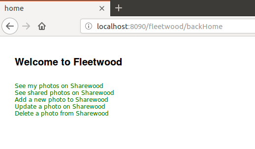
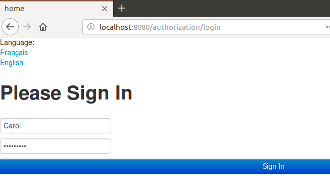
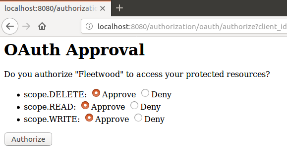

# sharewood-odyssey
I present here a microservice-oriented version of the previous project https://github.com/dubersfeld/sharewood-boot-oauth2. It uses Zuul as a reverse proxy and all servers run in Kubernetes pods.

Here are the prerequisites for running the complete application:

Any recent Linux platform (I use Ubuntu 18.04)

A recent Apache Maven version installed (I use 3.3.9)

A recent Docker version installed (I use 17.12.1-ce)

A recent Minikube version installed (I use 1.0.0). Note that Minikube require Virtualbox to run.

A Docker Hub account can help for a clean deployment but is not required.

In addition I used Spring Tool Suite for developing this demo but it is not required for running the application.

The complete application is comprised of an OAuth2 authorization server and an OAuth2 resource server. The resource server is hidden behind a reverse proxy. The authorization server is not.

A separate Eureka server is used to register the resource server.

An additional user server is used to provide user authentication needed for Authorization Code Grant.

A separate Spring Cloud configuration server sets all deployment configuration properties for the three servers and the gateway that all have spring-cloud-config-client dependency. It fetches properties from a Kubernetes Config Map, not from a GitHub repository. All configuration YAML files are stored in the subdirectory config-repo.

Three separate databases are used to persist Oauth2 tokens, photos and users.

The dependencies are summarized on figure below:


Project name         | Application name | Port | Database                             | Routing
-------------------  | ---------------- | ---- | -------------------------------------| -------------------------
authorization-server | authorization    | 8080 | sharewood\_tokens                    |
sharewood-resource   | sharewood-server | 8081 | sharewood\_tokens, sharewood\_photos | sharewood
sharewood-config     |                  | 8888 |                                      |
sharewood-gateway    | zuul-service     | 5555 |                                      |
user-server          | users-service    | 9090 | sharewood\_users                     |
eureka-service       |                  | 8761 |                                      |

Here are the steps to run the application.

# 1. Database images creation

## 1.1. sharewood_photos
In a terminal run the command:
```
eval $(minikube docker-env)
```
After this command all Docker images are build inside Minikube context, not host context.

In directory kubernetes/photos run the script photosBuild.sh then run the script createPV.
It creates a persistence volume claim named photosmysql-pvc.

## 1.2. sharewood_users
In directory kubernetes/users run the script usersBuild.sh then run the script createPV.
It creates a persistence volume cliamed named usersmysql-pvc.

## 1.3. sharewood_tokens

In directory kubernetes/tokens run the script tokensBuild.sh then run the script createPV.
It creates a persistence volume claim named usersmysql-pvc.

Note that all redirect URIs used by a registered client have to be explicitly declared. This happens in this line of the file sharewoodTokenDB.sql:

```
INSERT INTO oauth\_client_details (
  client_id, 
  resource_ids, 
  client_secret, 
  scope, 
  authorized\_grant_types, 
  web\_server\_redirect_uri,
  authorities,
  access\_token_validity,
  refresh\_token_validity,
  additional_information,
  autoapprove)
VALUES('Fleetwood', 'SHAREWOOD', '{bcrypt}$2a$10$xMgMQRCnrZ.vf/8WxyIwrOTiFKGJF72FYGxUjnSIWQMpFxFTtoU.2', 'READ,WRITE,DELETE', 'authorization\_code', 'http://localhost:8090/fleetwood/sharewood/photosMy,http://localhost:8090/fleetwood/sharewood/sharedPhotos,http://localhost:8090/fleetwood/sharewood/updatePhoto,http://localhost:8090/fleetwood/sharewood/deletePhoto,http://localhost:8090/fleetwood/sharewood/createPhotoMulti,http://localhost:8090/fleetwood/sharewood/getToken', 'ROLE_CLIENT', '520', null, '{}', null);
```

# 2. Docker Spring images creation

In each project directory:
1. config-server
1. eureka-service
1. user-server
1. authorization-server
1. sharewood-resource
1. zuul-server

run the command:
```
eval $(minikube docker-env)
```
then run the Maven command:
```
[sudo] mvn clean package docker:build
```
This will create all the Spring Boot images except for sharewood resource that requires an additional step.
In directory kubernetes/sharewood run the script sharewoodBuild.sh. It creates a new image named sharewood/sharewood populated with some photo JPG files. Then run the script createPV. It will create one more persistence volume claim.  

## 3. Launching the applications

In directory kubernetes run the commands:

kubectl create -f run-photos-mysql.yaml
kubectl create -f run-tokens-mysql.yaml
kubectl create -f run-users-mysql.yaml
kubectl create -f run-config-service.yaml
kubectl create -f run-eureka-service.yaml
kubectl create -f run-authorization-service.yaml
kubectl create -f run-user-service.yaml
kubectl create -f run-zuul-service.yaml

It will start all the servers in Kubernetes pods. Run the command `$ kubectl get pods`. The response should look like:
```
$ kubectl get pods
NAME                                     READY   STATUS    RESTARTS   AGE
authorization-service-66774c8c67-hw9q5   1/1     Running   0          172m
config-service-866c4679d8-58n2x          1/1     Running   0          81m
eureka-service-68b4648869-vwvkv          1/1     Running   0          175m
photos-mysql-7bbbd6c4d4-6bgdg            1/1     Running   0          3h6m
sharewood-service-68f5d5767d-55cg8       1/1     Running   0          65m
tokens-mysql-57c587d9f6-mh5bm            1/1     Running   0          3h3m
user-service-76f5d9b8f9-6sx5l            1/1     Running   0          173m
users-mysql-689ddcd57d-f84q5             1/1     Running   0          3h1m
zuul-service-8d5cc9ccd-9rdnt             1/1     Running   0          29m
$ 
```
When pod sharewood-service-xxxx is ready enter this pod by running the command:
```
$ kubectl exec -it sharewood-service-xxxx /bin/sh
```
and inside the pod shell run the command:
```
# cp tmp/photos/* home/photo/home
```
This populates the persistence volume attached to the pod.

## 5. Forwarding ports

Run the command `$ kubectl get svc`. The response should look like:

```
$ kubectl get svc
NAME                    TYPE        CLUSTER-IP       EXTERNAL-IP   PORT(S)    AGE
authorization-service   ClusterIP   10.102.182.15    <none>        8080/TCP   3h5m
config-service          ClusterIP   10.101.242.203   <none>        8888/TCP   94m
eureka-service          ClusterIP   10.100.191.2     <none>        8761/TCP   3h8m
kubernetes              ClusterIP   10.96.0.1        <none>        443/TCP    3h19m
photos-mysql            ClusterIP   10.106.167.234   <none>        3306/TCP   3h18m
sharewood-service       ClusterIP   10.108.177.89    <none>        8081/TCP   78m
tokens-mysql            ClusterIP   10.102.176.51    <none>        3306/TCP   3h16m
user-service            ClusterIP   10.101.23.136    <none>        9090/TCP   3h6m
users-mysql             ClusterIP   10.100.95.130    <none>        3306/TCP   3h14m
zuul-service            ClusterIP   10.109.194.89    <none>        5555/TCP   42m
```

Only the two service ports 8080 and 5555 need to be forwarded. This can be done by running these commands:

```
kubectl port-forward authorization-service 8080 8080
kubectl port-forward zuul-service 5555 5555
```

## 6. Launching the client

In fleetwood directory run the command:
```
mvn spring-boot:run
```
to start the client.



The users server is populated with two users Alice and Carol who have the role USER. Their passwords are:
Alice: o8p7e6r5a
Carol: s1a2t3o4r

Now the user is presented the authentication page and approval page shown below. Note that the only port exposed is the proxy port 5555.




Note: it takes some time for the routes to be taken into account. The actual delay depends on the machine.

Once logged the user can execute all RESTful request after authenticating to the authorization server and granting to fleetwood the required scope. Note that all changes are persisted even if the servers are taken down for example by the command:
```
[sudo] docker-compose down
``` 


